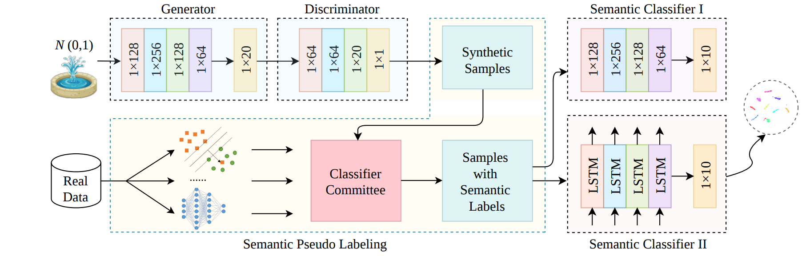

# Quality-Aware Self-Training on Differentiable Synthesis of Rare Relational Data (QAST, AAAI 2023)

This repository contains the Pytorch implementations of the following AAAI 2023 paper:

Chongsheng Zhang, Yaxin Hou, Ke Chen, Shuang Cao, Gaojuan Fan, Ji Liu. Quality-Aware Self-Training on Differentiable Synthesis of Rare Relational Data. Thirty-Seventh AAAI Conference on Artificial Intelligence, 2023(AAAI 2023). &nbsp; &nbsp;[Paper]()

## Introduction
 
This work (QAST) aims to generate realistic samples for the rare classes in a relational data. In fact, it has been a critical concern on how to utilize GAN to generate samples that are useful for imbalance learning, i.e., the generated synthetic samples should be useful for improving the imbalance learning performance. 



Abstract: Data scarcity is a very common real-world problem that poses a major challenge to data-driven analytics. Although a lot of data-balancing approaches have been proposed to mitigate this problem, they may drop some useful information or fall into the overfitting problem. Generative Adversarial Network (GAN) based data synthesis methods can alleviate such a problem but lack of quality control over the generated samples. Moreover, the latent associations between the attribute set and the class labels in a relational data cannot be easily captured by a vanilla GAN. In light of this, we introduce an end-to-end self-training scheme (namely, Quality-Aware Self-Training) for rare relational data synthesis, which generates labeled synthetic data via pseudo labeling on GAN-based synthesis. We design a semantic pseudo labeling module to first control the quality of the generated features/samples, then calibrate their semantic labels via a classifier committee consisting of multiple pre-trained shallow classifiers. The high-confident generated samples with calibrated pseudo labels are then fed into a semantic classification network as augmented samples for self-training. We conduct extensive experiments on 20 benchmark datasets of different domains, including 14 industrial datasets. The results show that our method significantly outperforms the comparative methods, including two recent GAN-based data synthesis schemes.

## Prerequisites

All codes are written by Python 3.8 with:

* Operating System: Windows 10
* torch              1.13.0
* torchaudio         0.13.0
* torchvision        0.14.0
* pandas             1.5.2
* scikit-learn       1.1.3
* imbalanced-learn   0.9.1
* numpy              1.23.5
* openpyxl           3.0.10

## Code structure description

```
   QAST
   ├──data
   │   ├──generated_data
   │   ├──original_data  
   │   └──spilted_data
   │
   ├──model
   │   ├──stage-1
   │   └──stage-2
   │
   ├──trained_model
   │   ├──stage-1
   │   └──stage-2
   │
   ├──test
   │   ├──GBDT_LOG
   │   ├──BLSTM_LOG
   │   ├──BLSTM-test.py
   │   └──GBDT-test.py
   │   
   ├──utils
   │   ├──model.png
   │   ├──model.py
   │   ├──split_data.py
   │   └──transformer.py 
   │
   ├──Multi-class.py
   ├──Multi-class.py
   └──README.MD
```   
  
## Train

* To train a generator to generate data:

   ```
   python QAST_train.py --dataset CWRU_Bearing_Dataset_1_20
   ```
  
* To train a classifier for class-imbalanced data using original and generated data:

   ```
   # To train a classifier with GBDT:
   python test/GBDT-test.py --dataset CWRU_Bearing_Dataset_1_20
   ```
   or
   ```
   # To train a classifier with BLSTM:
   python test/BLSTM-test.py --dataset CWRU_Bearing_Dataset_1_20
   ```
  
## Inference/Test
 
   To test the generator with the trained model(CWRU Bearing)

  ```
   python QAST_test.py --dataset CWRU_Bearing_Dataset_1_20
   ```

   To test the classifier with the trained model(CWRU Bearing)

   ```
   python test/BLSTM-test.py --pretrained --dataset CWRU_Bearing_Dataset_1_20
   ```

## Our Trained models
Under the folder “trained_model”, we have uploaded our trained models for the CWRU Bearing Dataset. 

*  Generation model is at `./trained_model/stage-1/`


*  Classification model is at `./trained_model/stage-2/`

## Citation

If you find our method useful, please consider citing our paper:

  ```
  @inproceedings{qastaaai2023,
    title={Quality-Aware Self-Training on Differentiable Synthesis of Rare Relational Data},
    author={Chongsheng Zhang and Yaxin Hou and Ke Chen and Shuang Cao and Gaojuan Fan and Ji Liu},
    booktitle={Thirty-Seventh AAAI Conference on Artificial Intelligence ({AAAI} 2023)},
    year={2023},
  }
  ```